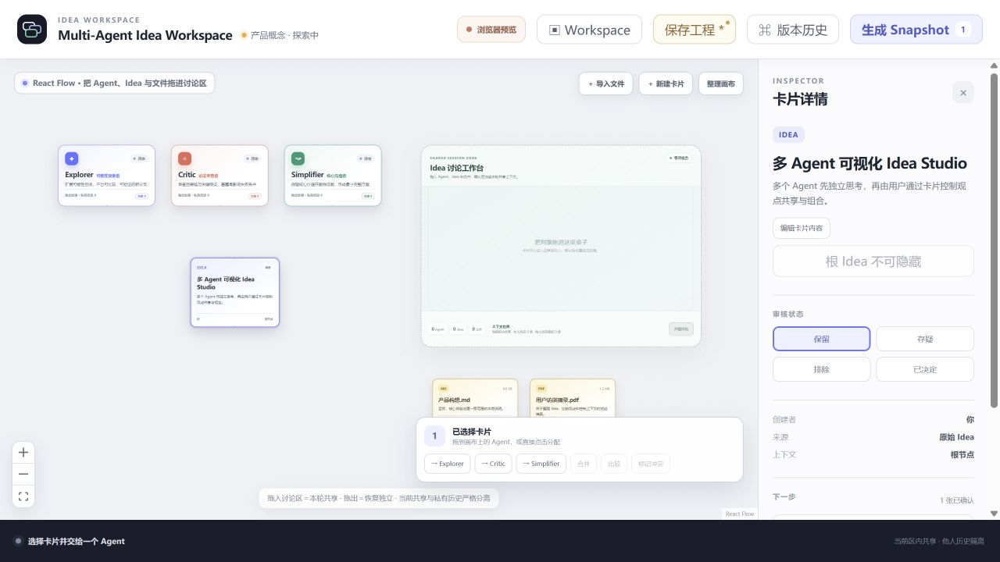

# Idea Workspace

一个用于完善 Idea 的本地 Multi-Agent 可视化白板。桌面版可以连接 OpenAI 官方接口或兼容的自定义中转站；工程、卡片和 Agent 私有历史保存在本机。

> **Windows 下载：** [下载 Idea Workspace v0.1.0 安装程序](https://github.com/yunhangJ/multi-agent-idea-workspace/releases/download/v0.1.0/Idea-Workspace_0.1.0_x64-setup.exe) · [查看 Release 说明与 SHA-256 校验文件](https://github.com/yunhangJ/multi-agent-idea-workspace/releases/tag/v0.1.0)

该安装包尚未进行商业代码签名，Windows SmartScreen 可能显示“未知发布者”。请从上方 GitHub Release 下载并核对 SHA-256；安装后需自行配置 OpenAI API Key，仓库和安装包均不附带 API Key。

本项目以 [MIT License](LICENSE) 开源。第三方依赖继续遵循各自的许可证，详情见 [`THIRD_PARTY_NOTICES.md`](THIRD_PARTY_NOTICES.md)。

## 为什么不是普通聊天窗口

Idea Workspace 把 Agent、想法、文件和讨论区都放到同一张白板上。空间关系本身就是上下文授权：卡片交给某个 Agent 时只进入该 Agent 的本轮输入；对象进入 Discussion Zone 后才成为本轮共享材料；移出后恢复独立处理。其他 Agent 的私有历史不会因此被共享。



## 桌面版使用

1. 安装并启动 Idea Workspace。
2. 点击右上角“连接 AI 服务”。
3. 选择 `OpenAI Responses`、`OpenAI Chat Completions` 或“自定义 / 中转站”。
4. 确认完整的请求地址和模型列表地址。自定义地址必须是 HTTPS；无认证的本机服务可以使用 localhost HTTP。
5. 选择 Bearer 认证并填写自己的 API Key，或为不需要认证的本机服务选择“无认证”。
6. 点击“获取模型列表”选择服务返回的模型，也可以直接手动填写模型 ID。
7. 点击“保存并测试模型列表”，然后把一张或多张卡片交给画布上的单个 Agent；也可以把多个 Agent 与材料放入 Discussion Zone 后开始讨论。

当前支持两种请求协议：

- OpenAI Responses：向完整的 `/v1/responses` 地址发送请求，格式参见 [OpenAI Responses 文本生成指南](https://developers.openai.com/api/docs/guides/text)。
- OpenAI Chat Completions：向完整的 `/v1/chat/completions` 地址发送请求，格式参见 [OpenAI Chat API 参考](https://developers.openai.com/api/reference/resources/chat)。
- 模型列表：从用户填写的地址执行 GET；原生支持 OpenAI 的 `data[].id` 结构，并兼容常见的 `models[]`、字符串数组、`id/model/name` 字段。OpenAI 标准格式参见 [Models API 参考](https://platform.openai.com/docs/api-reference/models/object?lang=curl)。

“保存并测试模型列表”只验证模型列表地址和认证信息。真正的生成请求地址会在首次 Agent Run 时得到验证；模型列表读取失败也不会阻止用户手动填写模型名。

### 自定义中转站的安全边界

- 第三方中转站会收到 API Key，以及用户明确授权给本轮 Agent 的全部卡片、文件正文和该 Agent 自己的历史摘要；只应填写可信服务。
- 应用不会持久化 API Key。输入期间 Key 会短暂存在于设置界面内存，随后交给本机 Rust 后端，并由后端发给所选服务。
- 后端只在当前应用进程内存中保存 Key；Key 不进入 Zustand、卡片、Agent 记忆、日志、localStorage 或 `.idea-workspace.json` 工程文件。
- 关闭设置窗口、切换协议、认证方式或接口地址会清空密码输入框；切换服务地址后必须重新填写 Key。
- Bearer 认证要求请求地址与模型列表地址同源，禁止重定向、URL 用户信息、查询参数和片段，避免凭据被带到其他地址。
- 关闭应用后 Key 自动消失，下次启动需要重新填写。协议、地址、模型名等非秘密偏好会单独保存在本机。
- 浏览器预览不会接收 Key，也不会调用真实模型。

项目实现的是 OpenAI Responses 和 OpenAI Chat Completions 协议兼容层。核心仓库不预置、不测试、也不推荐任何第三方模型提供商；如果用户自行填写代理或兼容地址，应独立评估该服务对凭据和内容的处理方式。

## 运行机制

- 单 Agent Run：只发送用户明确授权的冻结卡片，以及该 Agent 自己的冻结历史摘要。
- 多卡片输入：一个 Agent 可以在一次 Run 中同时处理多张卡片。
- Discussion Run：每个参与 Agent 先分别处理“本轮共享材料 + 自己的历史”；随后只把各 Agent 本轮生成的提案交给独立综合步骤。
- 隐私隔离：其他 Agent 的旧历史不会进入当前 Agent 的请求；只有用户明确放入本轮共享区的卡片可以跨 Agent 分享。
- 结构化输出：模型返回 1–5 张 `Idea / Question / Assumption / Decision` 卡片，再写入白板和来源记录。
- 中断与重试：中断会终止本机后端持有的网络任务；重试复用原本冻结的上下文。

一次单 Agent Run 通常产生一次 API 请求。一次 Discussion Run 会产生“参与 Agent 数量 + 1”次请求，其中最后一次用于综合本轮提案。费用、限流、内容处理和可用模型由用户选择的服务负责。

当前版本使用一套全局活动 AI 配置，三个 Agent 仍通过角色提示词与私有历史彼此隔离，但不会分别绑定三套模型或服务。

## 本地开发

环境要求：

- Node.js 22.12 或更高版本；
- pnpm 11；
- 桌面开发需要 Rust 1.88 或更高版本、Windows MSVC 构建工具和 Microsoft Edge WebView2 Runtime。

```powershell
pnpm install --frozen-lockfile
pnpm dev
```

浏览器访问 `http://127.0.0.1:5173/`。浏览器模式保留确定性的预览结果，仅用于检查白板交互。

启动 Tauri 桌面开发版：

```powershell
pnpm desktop:dev
```

生成 Windows 安装包：

```powershell
pnpm desktop:build
```

## 验证命令

```powershell
pnpm typecheck
pnpm test
pnpm build
cd src-tauri
cargo test
```

更完整的开发、隐私与发布说明见：

- [`docs/development.md`](docs/development.md)
- [`docs/privacy-security.md`](docs/privacy-security.md)
- [`docs/releasing.md`](docs/releasing.md)
- [`docs/github-publishing.md`](docs/github-publishing.md)
- [`CONTRIBUTING.md`](CONTRIBUTING.md)
- [`SECURITY.md`](SECURITY.md)

## 当前能力

- 新建、打开、保存和另存为 `.idea-workspace.json` 工程；
- 本机自动恢复副本和工程 dirty 状态；
- React Flow 无限白板以及可拖动的 Agent、Idea、文件和 Discussion Zone；
- Explorer、Critic、Simplifier 三个固定认知角色；
- 单 Agent 多卡片授权、动作选择、真实 AI 运行、中断和冻结上下文重试；
- OpenAI Responses、OpenAI Chat Completions、自定义请求/模型列表地址、Bearer 或无认证、手填模型及远程模型列表；
- 受控多 Agent 讨论、逐 Agent 私有历史隔离与本轮提案综合；
- Markdown、TXT 正文导入；PDF 当前仅导入元数据；
- 卡片新建、编辑、多选、合并、比较、冲突、审核、隐藏与恢复；支持右键或 `Delete` 永久删除普通卡片；
- Agent 私有历史、上下文审计、Snapshot 和版本历史；
- Tauri Windows 桌面壳及 NSIS 安装包。

当前没有流式 token 展示、PDF 正文解析、通用撤销/重做、任意自定义 Agent、每 Agent 独立模型配置或云端同步。产品交互与上下文边界见 [`docs/core-loop.md`](docs/core-loop.md)。

## 仓库边界

公开 Git 仓库只包含核心 React/Tauri 应用、测试、合成示例和工程文档。本机安装副本、用户 Workspace、构建缓存、日志、宣传成片和独立视频制作工程不会进入 Git；安装包与视频将在完成发布审计后作为 GitHub Release 附件分发。具体边界见 [`ASSETS.md`](ASSETS.md)。

## 许可证

项目自有的核心应用源代码、合成演示内容与文档按 [MIT License](LICENSE) 发布。第三方组件不因本项目采用 MIT 而被重新授权。
