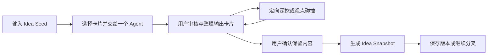

# Multi-Agent Idea Workspace：核心交互契约

> 文档状态：M2 / 通用 AI Runtime 桌面运行版
> 适用范围：个人、本地优先、非商业化的第一版原型
> 本文目的：固定产品的核心价值和交互语义。在本文验收条件满足前，不进入复杂 Agent 编排、每 Agent 多模型绑定或正式数据库设计。

## 1. 产品定义

### 1.1 一句话定义

Multi-Agent Idea Workspace 是一个由用户主持、多个独立 AI 视角参与的可视化 Idea Studio，帮助用户把模糊的初始想法扩展、质疑、简化、重组，并沉淀为可追溯的 Idea Snapshot。

### 1.2 首个目标场景

第一版只服务一个场景：

> 用户输入一个尚不完整的产品想法，选择具体卡片并将它交给某一个固定 Agent；Agent 按探索、批判或简化职责单独处理被授权内容。用户可以反复定向处理或组织受控讨论，最终形成更具体的 Idea Snapshot。

第一版不尝试覆盖一般问答、代码开发、文献研究、项目管理或多人协作。

### 1.3 产品要解决的核心困难

普通线性聊天在完善 Idea 时存在以下限制：

- 新旧观点只能按时间顺序堆积，难以重新组织；
- 多个方向容易混在同一段上下文中并过早收敛；
- 用户难以控制某条信息何时、向哪个视角传播；
- 被否决、保留和待验证的内容缺少明确状态；
- 最终总结通常丢失观点的来源及演变过程。

本产品的核心价值不是“让多个 Agent 自动开会”，而是让用户能够看见、选择并控制观点之间的关系和传播。

## 2. 产品原则

### 2.1 用户是主持人

Agent 提供候选观点，用户决定保留、排除、共享、合并和收敛。系统不得把 Agent 共识当作用户决策。

### 2.2 先独立，后共享

每次单 Agent Run 只能看到用户明确分配的卡片、自身职责和自己的私有历史。其他 Agent 的输出默认不可见，根 Idea 也不会因为位于白板上就自动加入上下文。

### 2.3 卡片优先于聊天

Agent 的主要产物是短小、单一语义、可操作的卡片，而不是长篇对话。聊天可以作为运行细节存在，但不是白板的中心对象。

### 2.4 每个视觉动作必须改变产品语义

拖拽、叠放、连线和分组不能只产生视觉效果，必须对应上下文授权、观点关系或运行操作。

### 2.5 限制优于自动扩张

第一版默认三个 Agent；每次运行最多生成五张卡片；Agent 不得自主创建 Agent、无限讨论或自动广播上下文。

### 2.6 保留分歧和来源

系统不以“所有 Agent 达成一致”为目标。冲突、未解决问题和被放弃方向都可以保留，但必须能追溯来源。

## 3. 核心循环



核心循环不是一次性流水线。用户可以在“审核整理”和“定向深挖”之间往返，直到认为当前 Idea 已足够具体，再主动生成 Snapshot。

## 4. 固定 Agent

MVP 只提供三个固定 Agent，不允许用户创建自定义角色。

角色不是动作权限，也不是只有名称不同的人格包装。Explorer、Critic 和 Simplifier 都可以执行扩展、批评、简化、回答和相反方案，但必须始终通过各自的专业观察视角解释动作：动作决定本轮要做什么，角色决定如何观察、判断和组织输出。每个固定角色都具有独立的专攻使命、工作方法、成功标准、禁止退化行为、偏好卡片类型和逐动作执行透镜。

### 4.1 Explorer

**角色**：可能性探索者。

**目标**：扩大 Idea 的有效可能性空间，提出在用户、场景、机制、约束或关键前提上真正不同的方向。

**主要输出**：Idea Card、Question Card。

**约束**：

- 每个分支说明改变了什么、为什么可能成立和下一步应验证什么；
- 区分事实、合理推测和待验证假设；
- 不用同义改写、空泛建议或无限功能堆叠冒充探索；
- 执行“批评”时，重点寻找被忽略的可能性和替代机制，而不是退化成 Critic；
- 执行“简化”时，保留能产生最多后续可能性的核心概念，而不是套用通用 MVP；
- 每轮最多五张卡片。

### 4.2 Critic

**角色**：论证审查者。

**目标**：提高 Idea 的真实性和决策质量，审查目标、机制、假设、证据与结果之间的因果链。

**主要输出**：Question Card、Assumption Card。

**约束**：

- 优先识别高影响、难逆转且尚未验证的失败条件；
- 每项关键批评说明触发条件、影响、反例和所需证据；
- 区分已知、推断与未知，不虚构证据或把个人偏好包装成事实；
- 不输出“可能有风险、需要调研”等没有判别力的泛泛提醒；
- 执行“扩展”时扩展失败面、边界条件和依赖链，而不是扩展功能；
- 不直接替用户否决整个 Idea；
- 每轮最多五张卡片。

### 4.3 Simplifier

**角色**：核心压缩者。

**目标**：保留 Idea 不可替代的价值核心，同时减少状态、步骤、角色、接口和必须同时成立的假设。

**主要输出**：Idea Card、Decision Card 建议。

**约束**：

- 先明确谁在什么情境下，通过什么机制获得什么结果；
- 把元素划分为不可缺少、可以延期和应当删除；
- 每次删减说明保留的价值、放弃的能力和下一步验证；
- 不把缩短文字、“以后再完善”或套用通用产品模板当成简化；
- 执行“扩展”时只补充核心方案成立或可验证所必需的部分；
- Decision 只能作为建议，须由用户确认；
- 每轮最多五张卡片。

## 5. 核心对象

### 5.1 Workspace

一个 Idea 的完整工作空间，包含画布、Agent、卡片、关系、运行记录和 Snapshot 版本。

### 5.2 Idea Seed

用户输入的原始想法，创建后成为根 Idea Card。它和其他卡片遵循相同的显式授权规则；用户把它交给某个 Agent 后，该 Agent 才能处理它。

### 5.3 Card

MVP 只支持四种卡片：

| 类型 | 含义 | 可由谁创建 | 典型后续动作 |
|---|---|---|---|
| Idea Card | 新方向、功能、场景、变体或融合方案 | 用户、Explorer、Simplifier、合并操作 | 扩展、批评、简化、合并 |
| Question Card | 尚未回答、需要澄清的问题 | 用户、Explorer、Critic | 回答、分配、暂存 |
| Assumption Card | 当前依赖但未经验证的判断 | 用户、Critic | 批评、改写、标记待验证 |
| Decision Card | 用户确认保留或排除的方向 | 用户；Simplifier 只能提出建议 | 纳入 Snapshot、撤销决定 |

每张卡片至少包含：

- 唯一标识；
- 类型；
- 标题；
- 简短正文；
- 创建者；
- 来源运行；
- 父卡片或输入卡片；
- 用户状态；
- 创建和更新时间。

### 5.4 Agent

Agent 是固定认知任务的执行者，不是人格化聊天角色。Agent Card 本身是可拖动的白板对象，显示名称、职责、状态和私有历史数量；拖入 Discussion Zone 才表示参加本轮共享讨论。

### 5.5 Run

一次对 Agent 的实际调用。Run 是 UI 工作状态的唯一事实来源，至少记录：

- 被调用的 Agent；
- 操作类型；
- 用户本轮自定义指令的冻结副本（仅在选择“自定义指令”时存在）；
- 输入卡片集合；
- 本轮冻结的卡片快照和该 Agent 私有历史 ID；
- 当前状态；
- 生成的卡片；
- 是否失败或被中断；
- 开始和结束时间。

### 5.6 Relation

Relation 表示卡片之间的业务关系。MVP 只保留：

- `derived_from`：由某张卡片继续展开；
- `critiques`：对某张卡片的批评；
- `answers`：回答某个问题；
- `merges`：融合两张或多张卡片；
- `contradicts`：观点相互冲突；
- `included_in`：被纳入某个 Snapshot。

### 5.7 Idea Snapshot

用户主动触发的阶段性版本，不等于 Agent 自动总结。Snapshot 只使用用户明确保留或确认的内容。

### 5.8 Discussion Zone

Discussion Zone 是白板上的受控共享区域，不是纯视觉分组。Agent、Idea Card 和 File Card 的中心进入边界后成为本轮候选上下文；移出后恢复独立状态。拖入本身不运行模型，用户点击“开始讨论”时系统才冻结参与者和输入。

### 5.9 Agent Memory

每个 Agent 拥有独立的历史记忆，只记录它自己曾处理的输入和自己的运行摘要。一次共享讨论允许 Agent 读取：

- 当前 Discussion Zone 中冻结的共享输入；
- 当前讨论的参与者和本轮贡献；
- 自己此前的 Agent Memory。

默认禁止读取其他 Agent 的历史输出。只有用户把某张其他 Agent 的历史卡片明确拖入当前 Discussion Zone，它才作为本轮显式共享输入出现；这不会开放该 Agent 的其余历史。

## 6. 完整用户流程

### Step 1：创建 Workspace

用户输入 Idea 名称和一段自由文本，点击“创建 Idea”。

系统行为：

- 创建 Workspace；
- 创建根 Idea Card；
- 初始化三个固定 Agent；
- 不自动运行 Agent。

### Step 2：把卡片交给单个 Agent

用户选择一张或多张卡片，然后指定 Explorer、Critic 或 Simplifier 中的一个。系统显示本次授权清单和动作选项；用户确认后才创建单 Agent Run。

系统不提供“三个 Agent 同时开始首轮探索”的按钮，也不在创建 Workspace 后自动运行 Agent。

### Step 3：审核单 Agent 输出

用户逐张处理新卡片，可执行：

- 保留；
- 暂存；
- 排除；
- 编辑；
- 移动和分组；
- 查看来源。

未审核的卡片不得自动进入 Snapshot，也不得自动传播给其他 Agent。

### Step 4：继续定向处理

用户将一张或多张卡片拖到某个 Agent Card。释放后必须出现动作菜单，用户选择明确意图：

- 扩展这个方向；
- 批评这个观点；
- 简化这个方案；
- 回答这个问题；
- 提出相反方案；
- 自定义要求。

确认后，系统才将选中卡片授权给目标 Agent，并创建新的 Run。

选择“自定义指令”时，用户必须填写本轮具体要求。该指令只作用于当前列出的授权卡片，并继续受目标 Agent 的固定专攻、私有历史边界和结构化输出格式约束。确认后指令正文被冻结在 Run 中；中断重试必须复用同一副本，修改要求只能创建新 Run。自定义指令会发送给当前模型，并随 Run 进入本地恢复副本和工程文件，因此界面必须提醒用户不要填写 API Key、密码等秘密。

### Step 5：受控共享讨论

用户把至少两个 Agent，以及一张 Idea Card 或 File Card 拖入 Discussion Zone。区域实时显示参与者、共享输入和历史隔离状态。用户确认后点击“开始讨论”，系统冻结本轮上下文并创建 Discussion Run。

区内对象表示当前授权，区外对象不进入本轮上下文。Agent 可以使用自己的历史记忆，但不能读取其他 Agent 的历史输出。MVP 只模拟一轮有上限的讨论，不允许 Agent 自由无限对话。

### Step 6：确认方向

用户可以把重要卡片标记为：

- `kept`：保留；
- `uncertain`：存疑；
- `rejected`：排除；
- `decided`：已形成用户决策。

Agent 不能自行写入 `decided` 状态。

### Step 7：生成 Idea Snapshot

用户点击“生成 Snapshot”。系统使用用户确认的卡片整理当前 Idea，生成草稿供用户审阅和修改。

Snapshot 至少包含：

1. Idea 一句话定义；
2. 目标用户或使用场景；
3. 核心体验；
4. 主要组成部分；
5. 为什么可能有价值；
6. 关键假设；
7. 仍未解决的问题；
8. 当前决定保留的方向；
9. 被排除的方向及原因；
10. 建议的下一步验证。

### Step 8：保存版本或分叉

用户确认后保存 Snapshot。后续可以：

- 继续在当前 Workspace 探索；
- 从某张 Idea Card 分叉新方向；
- 从某个 Snapshot 创建新版本。

## 7. 拖拽和组合语义

| 用户动作 | 系统语义 | 是否需要确认 |
|---|---|---|
| 移动卡片到空白区域 | 只改变空间位置 | 否 |
| 将对象拖入 Discussion Zone | 加入本轮候选共享上下文 | 否；开始运行前统一确认 |
| 将对象移出 Discussion Zone | 从后续讨论移除；Agent 恢复独立处理 | 否 |
| 将卡片拖到 Agent | 准备向该 Agent 授权此卡片 | 是，必须选择动作 |
| 将两张卡片叠放 | 打开 Compare / Merge / Contradict 菜单 | 是 |
| 将 Question 拖到 Idea | 准备建立 `relates_to` 或要求回答 | 是 |
| 将卡片拖入 Snapshot 区域 | 标记为候选纳入内容 | 是 |
| 隐藏卡片 | 从当前画布隐藏；可从工具栏恢复 | 是 |
| 永久删除卡片 | 右键选择“永久删除”或选中后按 `Delete`；根 Idea 不可删除 | 否；冻结 Run 与已保存 Snapshot 仍作为历史保留 |

拖拽本身不得立即触发昂贵或不可逆的 Agent 运行。

## 8. Agent 上下文隔离与共享

### 8.1 单 Agent Run 隔离

三个 Agent 分别拥有独立的私有记忆边界。模型请求本身按无状态调用处理，应用每次只从冻结快照重新构造允许可见的上下文。每次单 Agent Run 的上下文只包括：

- 系统级安全和运行约束；
- 当前 Agent 的固定职责；
- 用户本次明确授权的卡片；
- 用户为本 Run 明确填写的自定义指令（如有）；
- 目标 Agent 自己的私有历史；
- 本轮要求的结构化输出格式。

不得包含其他 Agent 的私有输出历史或白板全部内容。某张其他 Agent 的输出卡只有被用户本轮明确授权时，才可作为普通输入卡片进入上下文。

### 8.2 后续授权

卡片只有在以下情况下才进入目标 Agent 上下文：

1. 用户将卡片拖到 Agent 并确认动作；
2. 用户在运行面板中显式选择卡片；
3. 用户发起 Compare、Merge 或 Critique，并明确目标 Agent。

每次 Run 必须保存实际输入卡片 ID，确保能够回答“这个 Agent 当时看到了什么”。

### 8.3 禁止默认广播

以下内容不得默认同步给所有 Agent：

- 其他 Agent 的新输出；
- 用户移动或分组卡片的行为；
- 未确认的 Snapshot 草稿；
- 被排除或暂存的卡片；
- 整个 Workspace 的自动摘要。

### 8.4 讨论上下文快照

每次 Discussion Run 必须按 Agent 分别保存上下文快照。快照包含当前共享卡片、当前共享文件、当前参与 Agent、该 Agent 自己的历史记忆 ID，以及编排器阻断的其他 Agent 历史记忆 ID。

“被阻断的历史 ID”仅用于本地审计，不得作为提示词内容发送给 Agent。其他 Agent 历史卡片只有在用户本轮显式拖入区域时，才能出现在 `explicitlySharedPeerCardIds` 中。

## 9. UI 信息架构

### 9.1 主布局

```text
┌────────────────────────────────────────────────────────────┐
│ Workspace 标题  运行状态                 [生成 Snapshot]   │
├────────────┬──────────────────────────────┬────────────────┤
│            │           白板画布            │ Inspector      │
│  Agent 卡  │   ┌─ Discussion Zone ───┐    │ 卡片详情       │
│  Idea 卡   │   │ Agent / Idea / File │    │ 来源与关系     │
│  File 卡   │   │ [开始讨论]           │    │ 状态和操作     │
│            │   └─────────────────────┘    │ Run 详情       │
├────────────┴──────────────────────────────┴────────────────┤
│ 可折叠运行栏：排队 / 运行 / 完成 / 中断 / 失败              │
└────────────────────────────────────────────────────────────┘
```

### 9.2 Agent 状态

MVP 使用以下状态：

- `idle`：没有运行；
- `queued`：等待执行；
- `running`：正在执行；
- `needs_user`：等待用户确认或输入；
- `completed`：本轮完成；
- `interrupted`：被用户中断；
- `failed`：运行失败。

UI 不使用无法验证的“正在深度思考”“灵感爆发”等状态。

### 9.3 Card 状态

- `unreviewed`：新生成，尚未审核；
- `kept`：用户决定保留；
- `uncertain`：存疑，暂不处理；
- `rejected`：排除；
- `decided`：已转化为用户决策。

## 10. 固定原型测试案例

### 10.1 Idea Seed

> 我想做一个帮助用户完善创意的多 Agent 可视化白板。多个 Agent 先独立思考，再由用户决定是否共享观点；用户可以通过拖拽卡片控制上下文关系。

### 10.2 Explorer 假输出

- 允许用户从同一个 Idea 分叉多个版本；
- 让用户选择探索视角，而不是手写复杂提示词；
- 保存被放弃的方向，避免未来重复探索；
- Question：这个工具首先服务哪一种 Idea？

### 10.3 Critic 假输出

- Assumption：更多 Agent 会带来更多有效观点；
- 多个 Agent 可能生成大量重复内容；
- 拖拽操作可能增加管理负担；
- Question：白板操作是否真的优于多个独立聊天窗口？

### 10.4 Simplifier 假输出

- 第一版只保留三个固定 Agent；
- 第一版只处理产品创意；
- 每次探索最多生成十五张卡片；
- 第一版不允许 Agent 自动多轮讨论。

### 10.5 必须演示的操作

使用以上假数据，原型必须能够完成：

1. 创建根 Idea；
2. 把根 Idea 交给一个指定 Agent 并选择动作；
3. 保留、暂存和排除该 Agent 的输出卡片；
4. 将一个 Critic 假设拖给 Explorer 并选择“提出替代方案”；
5. 合并两张 Idea Card；
6. 将一张卡片标记为用户 Decision；
7. 根据已确认卡片生成 Snapshot；
8. 查看任一卡片的来源链。
9. 把两个 Agent、一个 Idea 和一个文件拖入 Discussion Zone 并开始讨论；
10. 将一个 Agent 移出区域，确认它保留自己的历史但看不到其他 Agent 历史。

## 11. MVP 必须功能

- 创建、打开和保存单个本地 Workspace；
- 根 Idea Card；
- 三个固定 Agent；
- 四种卡片；
- 卡片创建、编辑、移动、分组、状态修改、软隐藏和永久删除；
- 浏览器预览模式下完成全部核心流程；
- 单 Agent 真实 AI 运行；
- 以冻结上下文和 Agent 私有记忆实现独立会话边界；
- 异步运行状态；
- 暂停或中断运行；
- 显式上下文授权；
- Discussion Zone 当前上下文组合；
- Agent 私有历史与跨 Agent 历史隔离；
- Compare、Merge、Critique 三种受控碰撞；
- Idea Snapshot 生成、编辑和版本保存；
- 卡片来源和 Run 追溯。

### 11.1 当前实现状态（2026-08-11）

当前前端已完成：

- 本地 Workspace 新建、原生打开、保存、另存为，以及独立 `.idea-workspace.json` 工程文件；
- 工程文件 dirty 状态、保存快捷键和本机自动恢复副本；
- 根 Idea、四种用户卡片的创建与编辑；
- 三个 Agent 作为白板卡片移动，并可查看各自私有历史；
- 单 Agent 多卡片定向处理和真实 AI API 运行；
- 单 Agent 自定义指令：冻结用户要求、空值与长度校验、运行记录摘要和原指令重试；
- OpenAI Responses 与 OpenAI Chat Completions 两种请求协议；
- OpenAI 官方地址、自定义中转请求地址、自定义模型列表地址、手填模型 ID 与在线模型列表；
- Discussion Run 的逐 Agent 独立提案与单独综合；
- 运行前上下文确认、真实网络中断、冻结上下文重试与输入快照审计；
- API Key 不被应用持久化：输入期间短暂存在于设置界面内存，配置后只保存在 Rust 进程内存；不进入工程、恢复副本、卡片、Agent 历史或日志；
- Discussion Zone 的成员拖入、拖出和受控共享语义；
- Markdown、TXT、PDF 文件卡导入；文本文件可读取正文，PDF 暂为元数据模式；
- Merge、Compare、Contradict 和定向 Critique；
- 卡片审核状态、Snapshot 草稿、保存版本和版本历史；
- 卡片软隐藏、隐藏或排除后的统一恢复入口，以及右键/`Delete` 永久删除；
- 自动整理画布，且不会改变 Discussion Zone 已授权成员；
- Tauri Windows 桌面壳及安装包构建；
- 浏览器开发模式保留确定性预览结果，但不会接收 Key 或调用模型。

尚未完成、属于下一阶段的部分：

- 真实流式 token 输出与运行失败恢复；
- PDF 正文解析；
- 从 Snapshot 创建分叉工作区；
- 通用多步撤销/重做。

因此，桌面版已经具备真实 AI 核心闭环。当前 API 返回后一次性落卡，运行中不会展示 token 或伪造模型思考过程。

## 12. MVP 明确不做

- Claude 等非 OpenAI 兼容请求协议；
- 用户自定义任意 Agent；
- Agent 自主创建 Agent；
- Agent 无限或自动多轮讨论；
- 多用户实时协作；
- 云端部署和账号系统；
- 移动端；
- 自由手绘和复杂绘图工具；
- 自动知识图谱；
- 向量数据库和长期自主记忆；
- 联网检索和自动事实核查；
- 插件市场；
- 商业计费；
- 复杂动画或模拟“思考过程”；
- 为不同 Agent 同时绑定多套 Runtime、服务或模型。

当前版本实现一套全局活动 AI Runtime，并支持 OpenAI Responses、OpenAI Chat Completions 及其兼容中转站。协议、完整请求地址、模型列表地址和模型名可替换，但三个 Agent 仍共享这套运行配置。用户明确授权的卡片与 Agent 自己的历史摘要才可以进入请求。

## 13. M0 验收标准

进入前端原型开发前，本文必须能够回答以下问题：

- 产品是否只有一个明确的首发场景？
- 用户从 Idea 到 Snapshot 的路径是否完整？
- 三个 Agent 的职责是否互不重复且容易理解？
- 每种卡片是否具有明确语义？
- 每个拖拽动作是否对应确定的产品行为？
- 用户是否能控制上下文共享？
- 单 Agent Run 是否只包含明确授权的卡片和自身历史？
- 用户是否拥有所有最终决策权？
- 卡片和运行是否可以追溯来源？
- 是否明确写出了第一版不做的内容？

本文已经给出上述问题的基线答案。后续如果原型测试推翻其中任何假设，应先更新本文，再修改实现。

## 14. 浏览器预览与桌面 AI 验收标准

首个可交互原型通过的条件：

- 浏览器预览不连接真实模型也能演示完整交互循环；
- 新用户无需解释即可完成至少一次卡片分配；
- 用户能够区分移动、分组、授权和合并；
- 十五张卡片同时存在时仍能找到未审核内容；
- 隐藏或排除操作可以恢复；永久删除不可恢复且不得删除根 Idea；
- Snapshot 不包含未被用户保留的卡片；
- 任一卡片都能查看创建者、输入来源和派生关系；
- 桌面版运行状态来自真实 Run 和网络任务；预览版定时结果必须明确标识为预览；
- API Key 不得出现在工程文件、自动恢复副本或日志中；
- 切换协议、认证方式或接口地址后必须清空待提交的 Key，并要求重新输入；
- Bearer 认证下请求地址与模型列表地址必须同源，且后端不得跟随重定向；
- 获取模型列表失败时仍允许手动填写模型名，不得阻断保存运行配置；
- “测试模型列表”不得声称已经验证真实生成接口；生成地址在首次 Run 时验证；
- 单 Agent 请求只包含明确授权的冻结卡片和自己的冻结历史；
- 自定义指令只能作为目标 Agent 本轮的 user 消息发送，不得提升为 system 指令、传播给其他 Agent 或进入讨论综合请求；
- Discussion 每个 Agent 的提案请求不得包含其他 Agent 的私有历史；
- 中断后迟到响应不得生成卡片；
- 完成一次测试后，可以指出至少一个被完善的 Idea 维度；
- 如果原型仅仅“更好看”而没有帮助重组和推进 Idea，则不得进入复杂后端开发。

## 15. 关键待验证假设

后续测试必须重点验证：

1. 三个固定认知视角是否产生足够不同的内容；
2. 用户是否愿意主动筛选卡片；
3. 空间布局是否比多个独立聊天窗口更容易回顾和组合观点；
4. 拖拽授权是否容易理解；
5. 每轮最多五张卡片是否合适；
6. 用户何时会主动生成 Snapshot；
7. 被排除方向是否值得保留在历史中；
8. Agent Card 应作为主要对象，还是只作为画布边缘工具；
9. 白板在二十至三十张卡片后是否产生过高认知负担；
10. 受控单轮碰撞是否足以替代自动多轮讨论；
11. 用户能否准确预测 Discussion Zone 内外对象的上下文权限；
12. 用户是否理解“共享当前内容”不等于“共享所有 Agent 历史”。

## 16. 下一步

M2 已把本地模拟 Run 替换为真实 AI API，并加入 OpenAI Responses、OpenAI Chat Completions 与自定义兼容中转地址：单 Agent 可以处理多张冻结卡片；Discussion 先按 Agent 隔离生成本轮提案，再进行独立综合；结构化结果会转换为 Card、Relation 和 Agent Memory。中断、失败、冻结上下文重试及跨 Agent 历史隔离已有自动化覆盖。

下一阶段应严格限定为稳定性工作：

1. 用测试账号完成 401、402、429、超时和真实响应的端到端验收；
2. 评估是否需要流式显示“已收到内容”，但不得展示伪造思维链；
3. 增加用户可见的 token 用量和 Discussion 请求次数提示；
4. 改进超长文件的截断说明和预算控制；
5. 解析 PDF 正文；
6. 实现通用撤销/重做；
7. 从 Snapshot 创建显式分叉工作区。

本阶段不建设多 Provider、云端数据库或 Agent 自动无限讨论。
